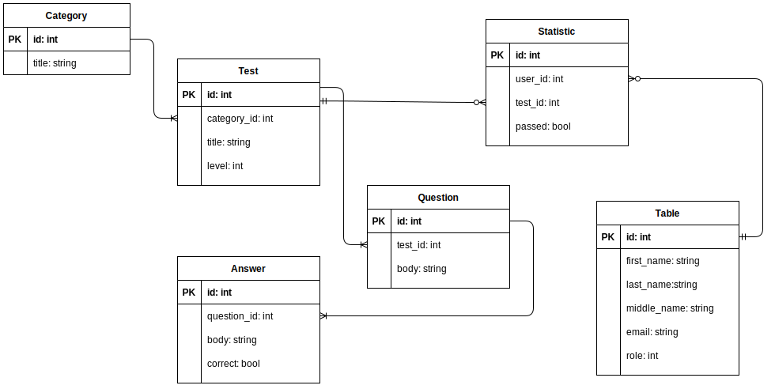

# Test Guru

Основные сущности:
1) Пользователь (обычный, администратор)
2) Категория (предметная область теста)
3) Тест (модель теста)
4) Вопрос (часть теста, принадлежит тесту)
5) Ответ (часть вопроса, принадлежит вопросу)
6) Статистика выполнения (результат выполнения теста, принадлежит пользователю и тесту)

